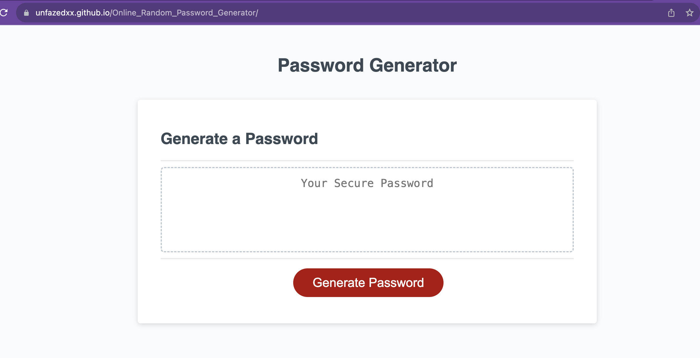

# Online_Random_Password_Generator

# challenge for module 3

**Project Title --
Module 3 challenge: Create a random password generator using javascript and the provided HTML/CSS COde

**Description --
create a javascript function which prompts the user to enter specific information regarding their desired password, and provide the password to the user once the prompts are complete. 

**Installing --
website can be viewed at: https://unfazedxx.github.io/Online_Random_Password_Generator/

**Author --
Kunal Shah NOVEMBER 2023

**Acknowledgments --
UTOR Bootcamp Module 3 - Javascript

